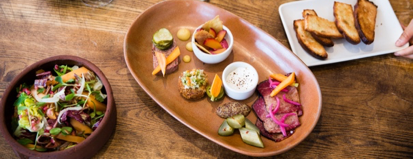

## Forecasting Restaurant Items
#### *Predicting item sales at three NYC restaurants*

*by Lyssa Treibitz | Galvanize Data Science Immersive | November 2018*
___

### The Data

I partnered with [Avero](http://www.averoinc.com/), a restaurant software solution, to explore a topic that has been of interest to us both: forecasting. They recently released a new product focused on forecasting restaurant covers (the number of guests expected), and wanted to take the forecast a step further, to predict the number of each menu item sold per day.

I received three years of restaurant item sales and daily weather from three restaurants. The data I was blinded, so I do not know the names of the restaurants nor the names of the items.  I only know which food or beverage category each item belongs to.

From the data, my predictive model uses the following to predict that day's item sales:

| Data Point       | Description      | Type
| ------------- |:-------------:| -----:|
| Covers| # of guests expected| Integer|
| DOW     | the weekday     |   Bool |
| Month     | the month    |   Bool |
| Temperature | high & low |   Integer |
| Precipitation | amount in inches  | Float |
| Sky description  | i.e. 'sunny', 'cloudy'  |  Bool |
| Humidity | percent humidity  |    Integer
| Item Last Year | item count same day last year| Integer |
| Item Last Week | item count same day last week | Integer |

___

### The Method

After experimenting with multiple regression models, I found that the best results derived from a Gradient Boosting Regressor.  

Gradient Boosting's objective is to minimize the loss of the model by adding weak learners one at a time using a gradient descent-like procedure. More specifically, each 'weak learner' represents a decision tree and the loss function to be minimized is Ordinary Least Squares regression.

I was focused on predicting one item at a time.  This means that, while the hyperparameters remained the same, each item was run through its own Gradient Boosting regression with its own unique splits.  

Additionally, since current performance is dependent on past performance, it was important to keep the time series intact. This meant that when looking at cross validation and train test splits, it was necessary to maintain chronology during cross validation.  To do so, I used the Time Series Split cross validation method, in addition to splitting off a final holdout set.  

 

Given that there are a large number of features, it was important to understand which features had the greatest impact on the model.

 

 Note that this graph is focused only on once specific item.  However, it is clear that only a handful of features are impacting the models overall outcome. This is led by number of covers, followed by last year and last week's item performance.
 ___

 ### The Results

 So far the results have varied greatly from item to item.  Ranging from the best case:

  

To the far from ideal case:

  

It's hard to say exactly what is going on here. This is where not knowing the actual item name becomes detrimental.  Perhaps this item is a "daily special" button in the POS that is used for different things on different days.  Perhaps the kitchen ran out of stock of a specific item.  Maybe the server who often recommends that item took a few days off.

Focusing back on the positive, I wanted to get a better understanding of whether the predictions I found for our best case scenario outperformed, say, simply predicting what was ordered the week before.

  

This plots the graphs against the same day last year, last week, and against Avero's current prediction method which takes the average of the item/cover for the same day of the last four weeks and multiplies it by the predicted covers for that day.

So far it does not look like I'm able to predict better than last week.  At least for this one item, for this specific holdout time period.

 ### Thank U, Next

 Moving forward to Capstone III, I will explore an LSTM recurrent neural net and hierarchical linear regression to see if I can improve upon these results with a goal of building a one-size fits all model that can output multiple items.

####  References
https://machinelearningmastery.com/gentle-introduction-gradient-boosting-algorithm-machine-learning/
