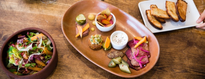

## Forecasting Restaurant Items
#### *Predicting item sales at three NYC restaurants*

Lyssa Treibitz
November 2018
___

### The Data

I partnered with [Avero](http://www.averoinc.com/), a restaurant software solution, to explore a topic that has been of interest for years: forecasting. They recently released a new product focused on forecasting restaurant covers (the number of guests expected per day), and wanted to take the forecast a step further, to predict the number of each menu item sold per day.

The data I received was blinded, so I do not know the names of the restaurants nor the names of the items.  I only know which food or beverage category the item belongs to. 

From the data, my predictive model uses the following:

| Data Point       | Description      | Type
| ------------- |:-------------:| -----:|
| Covers| # of guests expected| Integer|
| DOW     | the current dow      |   Bool |
| Month     | the current dow      |   Bool |
| Temperature | high & low for the day|   Integer |
| Precipitation | In inches for the day | Float |
| Sky description  | i.e. 'Sunny', 'Cloudy'  |  Bool |
| zebra stripes | are neat      |    $1 |
| col 3 is      | right-aligned | $1600 |
| col 2 is      | centered      |   $12 |
| zebra stripes | are neat      |    $1 |

Business:2  |  food|mc-beef-d|20319216        | RMSE: 7.0  | Mean: 32 | Perc: 22.2%
Business:2  |  food|mc-beef-d|20319254        | RMSE: 7.0  | Mean: 27 | Perc: 25.5%
Business:2  |  food|mc-beef-d|20319337        | RMSE: 11.0  | Mean: 57 | Perc: 19.2%
Business:2  |  food|mc-beef-d|20319309        | RMSE: 3.0  | Mean: 8 | Perc: 37.5%
Business:2  |  food|mc-beef-d|20319132        | RMSE: 12.0  | Mean: 27 | Perc: 45.1%
Business:2  |  food|mc-beef-d|20319310        | RMSE: 4.0  | Mean: 0 | Perc: 40000000000000.0%
Business:2  |  food|mc-beef-d|20319136        | RMSE: 2.0  | Mean: 2 | Perc: 92.9%
Business:2  |  food|mc-beef-l|20319299        | RMSE: 6.0  | Mean: 10 | Perc: 57.5%
Business:2  |  food|mc-beef-l|20319346        | RMSE: 3.0  | Mean: 5 | Perc: 60.9%
Business:2  |  food|mc-beef-l|20319128        | RMSE: 3.0  | Mean: 5 | Perc: 57.1%
Business:2  |  food|mc-beef-l|20319399        | RMSE: 3.0  | Mean: 4 | Perc: 85.4%
Business:2  |  food|mc-beef-l|20319087        | RMSE: 3.0  | Mean: 3 | Perc: 96.7%
Business:3  |  food|appetizers|22826289       | RMSE: 10.0  | Mean: 50 | Perc: 19.9%
Business:3  |  food|appetizers|22826270       | RMSE: 6.0  | Mean: 25 | Perc: 23.8%
Business:3  |  food|appetizers|22826246       | RMSE: 4.0  | Mean: 21 | Perc: 18.9%
Business:3  |  food|appetizers|22826232       | RMSE: 8.0  | Mean: 30 | Perc: 26.3%
Business:3  |  food|appetizers|22826649       | RMSE: 5.0  | Mean: 18 | Perc: 28.0%
Business:3  |  food|appetizers|22826299       | RMSE: 4.0  | Mean: 7 | Perc: 57.1%
Business:3  |  food|appetizers|22826234       | RMSE: 2.0  | Mean: 4 | Perc: 48.1%
Business:3  |  food|appetizers|22826264       | RMSE: 4.0  | Mean: 9 | Perc: 44.4%
Business:3  |  food|appetizers|24268802       | RMSE: 3.0  | Mean: 6 | Perc: 53.8%
Business:3  |  food|appetizers|24854302       | RMSE: 3.0  | Mean: 0 | Perc: 30000000000000.0%
Business:3  |  food|appetizers|22826309       | RMSE: 2.0  | Mean: 3 | Perc: 72.4%
Business:3  |  food|appetizers|24292860       | RMSE: 2.0  | Mean: 3 | Perc: 77.6%
Business:3  |  food|appetizers|22826218       | RMSE: 1.0  | Mean: 2 | Perc: 57.6%
Business:3  |  food|appetizers|27146590       | RMSE: 2.0  | Mean: 2 | Perc: 86.4%
Business:4  |  apps|apps|18207704             | RMSE: 53.0  | Mean: 59 | Perc: 89.3%
Business:4  |  apps|apps|18207678             | RMSE: 19.0  | Mean: 22 | Perc: 85.5%
Business:4  |  apps|apps|18207571             | RMSE: 26.0  | Mean: 24 | Perc: 109.4%
Business:4  |  apps|apps|18207677             | RMSE: 8.0  | Mean: 9 | Perc: 86.2%
Business:4  |  apps|apps|18207679             | RMSE: 10.0  | Mean: 10 | Perc: 95.8%
Business:4  |  apps|apps|18207570             | RMSE: 5.0  | Mean: 5 | Perc: 107.7%
Business:4  |  apps|apps|18850327             | RMSE: 17.0  | Mean: 13 | Perc: 131.0%
Business:4  |  apps|apps|18639799             | RMSE: 4.0  | Mean: 4 | Perc: 96.9%
Business:4  |  apps|apps|18448751             | RMSE: 8.0  | Mean: 5 | Perc: 150.0%
Business:4  |  apps|apps|18207594             | RMSE: 4.0  | Mean: 4 | Perc: 98.1%
Business:4  |  apps|apps|18207705             | RMSE: 3.0  | Mean: 2 | Perc: 146.2%
Business:4  |  apps|apps|27222735             | RMSE: 4.0  | Mean: 4 | Perc: 112.2%
